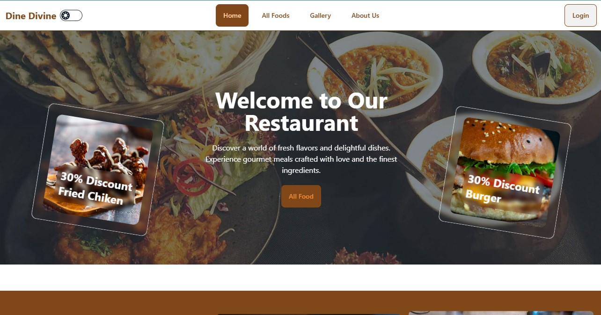

# Dine Divine

<div>
  
</div>

###
## Project Purpose
Dine Divine is a visually appealing and interactive website for a restaurant. The purpose of this project is to showcase the restaurant's offerings, highlight customer testimonials, and provide users with an intuitive navigation experience.

## Live URL
[Visit Dine Divine](https://dine-divine-0.web.app/)

## Key Features
- **Home Page**: Engaging landing page with high-quality visuals and a welcoming message.
- **Navigation Bar**: Easy access to different sections like Home, All Foods, and Gallery.
- **Customer Testimonials**: Dynamic Swiper carousel showcasing client reviews and ratings.
- **Responsive Design**: Fully optimized for all devices, including desktops, tablets, and mobiles.
- **Authentication**: Includes login/logout functionality with Firebase authentication.
- **Dark/Light Mode Toggle**: Seamless theme switching for enhanced user experience.

## NPM Packages Used
1. **react-icons**: For adding scalable vector icons.
2. **swiper**: To create a responsive and dynamic carousel for customer testimonials.
3. **firebase**: For authentication and hosting.
4. **react-router-dom**: For managing navigation and routing between pages.
5. **tailwindcss**: To style the website with utility-first CSS.
5. **Motion**: For animation.


## Technologies Used
- **React.js**: Frontend framework.
- **Tailwind CSS**: For responsive and modern styling.
- **DaysiUI**: For responsive and modern styling.
- **Firebase**: For authentication and deployment.
- **MongoDB**: As a Database.

### Run Locally:
- **Cloning the Repository**: The first step to get the project on your local machine.
- **Installing Dependencies**: Using `npm install` to set up the project.
- **Running the Project Locally**: You can view it on `http://localhost:5173`.

## Dependencies
    "axios": "^1.7.9",
    "date-fns": "^4.1.0",
    "firebase": "^11.1.0",
    "localforage": "^1.10.0",
    "lottie-react": "^2.4.0",
    "match-sorter": "^8.0.0",
    "motion": "^11.15.0",
    "react": "^18.3.1",
    "react-dom": "^18.3.1",
    "react-hot-toast": "^2.4.1",
    "react-icons": "^5.4.0",
    "react-rating": "^2.0.5",
    "react-router-dom": "^7.1.0",
    "react-spinners": "^0.15.0",
    "react-star-ratings": "^2.3.0",
    "sort-by": "^1.2.0",
    "swiper": "^11.1.15",
    "yet-another-react-lightbox": "^3.21.7"

## Dev Dependencies 
    "@eslint/js": "^9.17.0",
    "@types/react": "^18.3.17",
    "@types/react-dom": "^18.3.5",
    "@vitejs/plugin-react": "^4.3.4",
    "autoprefixer": "^10.4.20",
    "daisyui": "^4.12.22",
    "eslint": "^9.17.0",
    "eslint-plugin-react": "^7.37.2",
    "eslint-plugin-react-hooks": "^5.0.0",
    "eslint-plugin-react-refresh": "^0.4.16",
    "globals": "^15.13.0",
    "postcss": "^8.4.49",
    "tailwindcss": "^3.4.17",
    "vite": "^6.0.3"

## Deployment
The project is deployed on Firebase Hosting for fast and reliable access. To deploy updates, use the following commands:
```bash
firebase login
firebase init
firebase deploy
```

